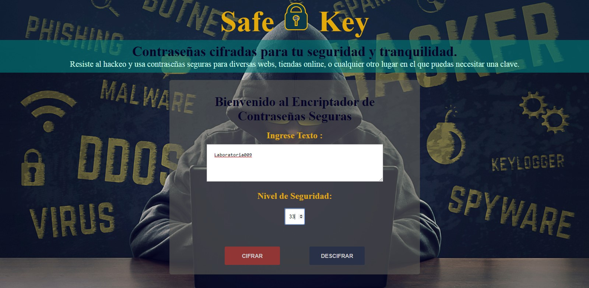

# Safe Key

## Introducción:

Todos utilizamos a diario las contraseñas para acceder a nuestro correo electrónico, a las redes sociales, foros o, incluso, para iniciar nuestro equipo. Las personas que usan claves débiles corren el riesgo de que estas sean descifradas por algún intruso que quiera robarnos la información. Sin duda, la primera línea de protección en internet es crear una contraseña segura para preservar nuestra información; quizás esto puede parecer un poco exagerado, pero lo cierto es que los "hackers" cuentan cada vez con mecanismos más sofisticados para piratear una clave. Lo que podría haberse considerado como una clave segura en su momento, ahora puede que sea una puerta entreabierta a sus cuentas. 

Incluso siendo cuidadosos nos exponemos a ciertos riesgos. Por ejemplo, hace cuatro años, el gigante estadounidense Yahoo! sufrió un robo masivo de información de las cuentas de sus usuarios. Más de 1.000 millones de cuentas fueron hackeadas con el riesgo que eso supone. Un año antes, Dropbox, un servicio de alojamiento de datos en la nube, sufrió otro robo masivo de información. Más de 68 millones de cuentas se vieron afectadas por este robo.

## ¿Cómo nace la idea de crear **Safe Key**?

Un informe reciente revela que más del 80% de las vulnerabilidades relacionadas con ataques de hackers se debe a contraseñas poco seguras o robadas. Por eso, si desea proteger tu información personal y activos, crear contraseñas seguras es un primer gran paso. Usar una contraseña kilométrica e imposible de recordar y que tengas que apuntarla en algún sitio, lo cual implica que otra persona pueda leerla o que la pierdas para siempre no es nada practico. Con Safe key podrás generar contraseñas seguras sin volverte loco, esta herramienta permite cifrar y descifrar textos deseados utilizando técnicas conocidas como algoritmos, mediante este algoritmo se genera una nueva contraseña aleatoria única  y segura.

## Definición del Producto

### ¿Quiénes son los principales usuarios de producto?

Personas en general que usen correo electrónico, redes sociales, foros, tiendas online, o cualquier otro lugar en el que puedas necesitar una clave.

### ¿Cuáles son los objetivos de estos usuarios en relación con tu producto?

El objetivo principal es contar con una herramienta que permita la creación de textos cifrados, así como la decodificación de estos, a través del uso de un desplazamiento específico de caracteres (offset). Ello permitirá a los usuarios tener una contraseña segura y confiable, así mismo evitar el hackeo de sus cuentas para apoderarse de su información personal o incluso tener acceso a servicios financieros.

### ¿Cómo crees que el producto que estás creando está resolviendo sus problemas?

Muchas personas pueden pensar que crear una contraseña segura lo pueden hacer ellos mismos, pero para estar realmente tranquilo con la contraseña que se ha elegido, es imprescindible recurrir a un servicio automatizado de creación de contraseñas. Que mediante el uso de tecnología de seguridad con aleatoriedad integrada genera de manera confiable una contraseña completamente segura que se ajusta a los requisitos de contraseñas exclusivas de diferentes sitios. 
Además, Una persona nunca genera una clave completamente aleatoria. Un servicio de generación de claves seguras sí, como lo es Safe Key. Tal vez estas contraseñas, algo complejas, sean difíciles de recordar, pero se pueden usar, por ejemplo, una carpeta que esté cifrada para que nadie pueda acceder ella, solo nosotros. 

## Decisiones de diseño que se tomaron 
Al tener definida la necesidad del usuario, se optó por diseñar un entorno sencillo, fácil de manejar, y que permita rapidez en su funcionamiento, así como en el entendimiento de las instrucciones. Para esto se consideró el uso de secciones estilizadas de forma amigable (cajas con bordes redondeados, centradas y de tamaño compacto).

### Paleta de colores

Los colores observados son bastante sobrios y denotan un tono serio, sobrio, elegante y profesional. La combinación está orientada a crear una armonía entre los elementos, priorizando su función principal, siendo el cifrar.

### Prototipo:

Se mostró el primer diseño  a las colaboradoras del equipo y se sugirió optimizar los colores, que estos estén en contraste con el fondo.

### ¿Cuál fue tu proceso para definir el producto final a nivel de experiencia y de interfaz?
En primer lugar, pensar en los usuarios para quienes se deseaba construir la aplicación y en las necesidades de estas y que pudieran conectar con la temática del producto (encriptado de mensajes).
Como segundo paso, definir la forma en la que pudieran interactuar con la aplicación, teniendo en cuenta que existen otras plataformas que ofrecen una mejor oferta para satisfacer las necesidades o resolver los problemas de los usuarios objetivo. Se pensó entonces en construir una herramienta rápida en funcionalidad, que vaya directo a su objetivo y ofrezca la sensación de satisfacción inmediata, brindando un poco más de lo que se espera. Como tercer punto se tomaron las decisiones de diseño, colores, emplazamiento y formas, así como la adición de interacción y atractivo visual. Posteriormente se presentaron los avances a discusión en el equipo de trabajo para recabar sugerencias e identificar errores.

## Descripción de las características y funcionalidades de Safe Key

Esta herramienta cuenta con dos secciones: Sección principal y sección de resultados 
En la sección principal muestra el logo de la aplicación, y las casillas para el rellenado del mensaje o texto desea cifrarse o descifrarse y la casilla de nivel de seguridad.
La entrada de la casilla para el rellenado del texto o mensaje solo acepta la entrada de letras y números. La entrada de la casilla de nivel de seguridad solo permite la escritura de números enteros superiores al 0. Asimismo, exige el ingreso de ambas condiciones, en caso contrario muestra un mensaje indicando que no se escribió nada.

También Se pueden apreciar dos botones: CIFRAR y DESCIFRAR. Cada uno realizan una acción distinta como se detalla:

**Botón CIFRADO:**
- Convierte el texto original en texto cifrado a partir del desplazamiento indicado en la casilla de nivel de seguridad 
- Al ser pulsado carga la siguiente sección, donde muestra un mensaje: "Listo! ya es secreto" junto con el texto cifrado.

**Botón DESCIFRADO:**
- Devuelve el texto original a partir del desplazamiento o nivel de seguridad brindado.
- Al ser pulsado carga la siguiente sección, donde muestra el mensaje: “Que interesante!” junto con el texto descifrado cifrado.

La segunda sección cuenta, asimismo, con dos alternativas de acción que son para el cifrado y descifrado así mismo el botón de nuevo mensaje.

**Botón NUEVO MENSAJE:**
- Retorna a la sección de bienvenida.

